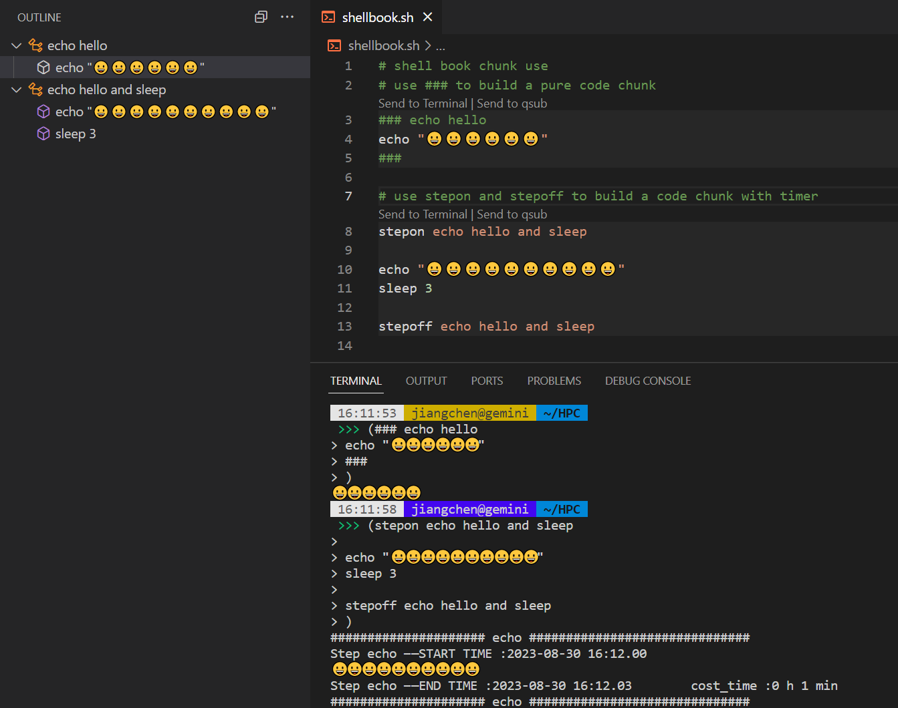

# Shell Book - The Shell notebook  Extension for VSCode
[中文README](./README_ZH.md)
Make your shell script as easy to use as a notebook, display code chunks, add snippets, enhance shell script development experience, and quickly execute custom commands.

## Features

1. **Code Chunk**: show chunk in shell script, send chunk code to terminal for running or qsub to SGE.
2. **Code Snippets**: Quickly insert commonly used shell commands and structures into your script with our pre-built code snippets.
3. **Auto-format**: Fast format your shell script.
4. **Chunk Outline**: You can see your chunk outline in left panel, double click to check in.
5. **Quick Command**: Execute shell commands directly within the VSCode interface, just click Shell Command in statusBar.
6. **Customization**: Customize Shell Book's settings and appearance to match your preferences and coding style.

## Installation

1. Open Visual Studio Code.
2. Press `Ctrl+P` to open the Quick Open dialog.
3. Type `ext install shellbook` and press `Enter`.
4. Restart Visual Studio Code to activate the extension.

## Usage

### Code Chunk
type in `code` or `chunk` to use.

### Shell Command
click Shell Command in statusBar. add your custom command.

### Shell Format
right click Document and choose format Document.

## Contributing

We welcome contributions to improve Shell book! If you have any ideas or suggestions, please feel free to submit an issue or a pull request on our GitHub repository.

## License

Shell Book is released under the [MIT License](https://opensource.org/licenses/MIT).

## Support

If you encounter any issues or need help using Shell Book, please reach out to our support team by submitting an issue on our GitHub repository. We are always happy to help!

---

Unlock the full potential of your shell scripts with Shell Book - Enjoy your coding!
