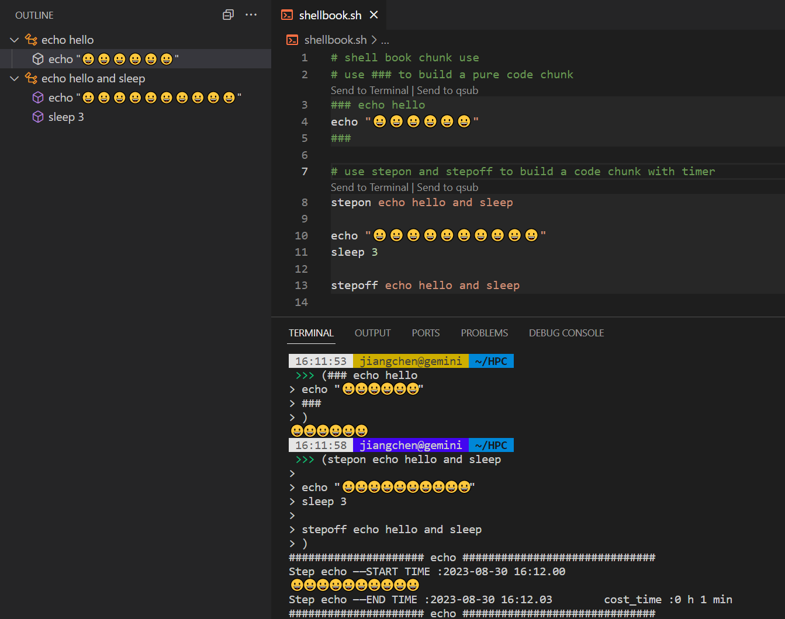
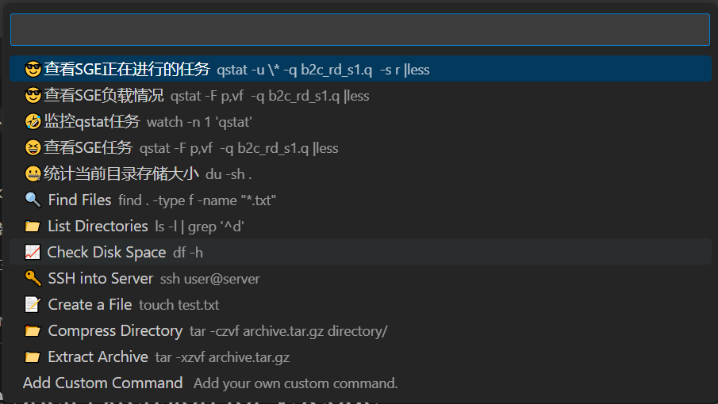

# Shell Book - The Shell notebook  Extension for VSCode
让你的shell脚本像notebook一样好用，显示codechunk，添加snippets，增强shell脚本开发体验，快速执行自定义指令

1. **代码块**：在shell脚本中显示块，将块代码发送到终端以运行或将qsub发送到SGE。
2. **代码片段**：使用我们的预构建代码片段快速插入常用的shell命令和结构到您的脚本中。
3. **自动格式化**：快速格式化您的shell脚本。
4. **块大纲**：您可以在左侧面板中查看块大纲，双击以检查。
5. **快速命令**：在VSCode界面中直接执行shell命令，只需单击状态栏中的Shell命令。
6. **自定义**：根据您的喜好和编码风格自定义Shell Book的设置和外观。

## 安装

1. 打开Visual Studio Code。
2. 按`Ctrl+P`打开快速打开对话框。
3. 输入`ext install shellbook`，然后按`Enter`。
4. 重新启动Visual Studio Code以激活扩展。

## 使用方法

### 代码块
输入`code`或`chunk`以使用。

### Shell命令
单击状态栏中的Shell命令。添加您的自定义命令。

### Shell格式化
右键单击文档，然后选择格式化文档。

## 贡献

我们欢迎您为改进Shell book做出贡献！如果您有任何想法或建议，请随时在我们的GitHub仓库上提交问题或拉取请求。

## 许可证

Shell Book根据[MIT许可证](https://opensource.org/licenses/MIT)发布。

## 支持

如果您遇到任何问题或需要帮助使用Shell Book，请通过在我们的GitHub仓库上提交问题联系我们的支持团队。我们始终乐于提供帮助！

---

通过Shell Book发掘shell脚本的全部潜力 - 享受您的编码！
